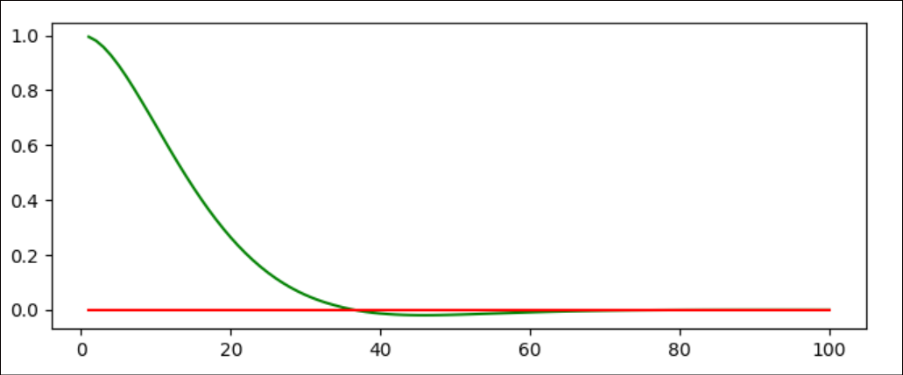

# pidcontrol
Lesson 12 classwork examples of the selfdriving nano degree. 

- [implementPcontroller.py]() is the first implementation of a p-controller and below is the output of it.

- [implementPDcontroller]() has the differential component added too. The robot now converges onto the reference track more smoothly. Here is the output

- [systematic_bias]() is when there is wheel misalignment. The car has the steering tyres not perfectly parallel to the x-axis. Even if the bias is in steering it manifests itslef in the Cross Traffic Error in Y direction. Output below

  

- pid-controller_output is the output with the integral term added too. 

  